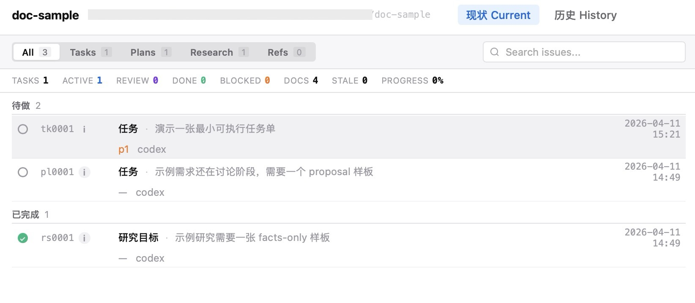

# agata-code-workflow

Agata-style file workflow skill for local Git projects.

Use it when you want a lightweight file-based workflow instead of a separate issue system.

- `issues/` is the truth source
- `tk` carries task state in the filename
- `rp` carries review evidence
- review files are task-first and round-based
- `coauthors.csv` is optional dispatch context

## What It Covers

- choosing between `pl` / `rs` / `tk` / `rp`
- filename-based state transitions
- task-first review naming
- `rvw` entry validation
- progress visualization
- optional AAAK memory
- keeping review evidence separate from task truth

## Install

Install the `agata-code-workflow/` folder as a local skill in your coding agent environment.

In each project, keep `AGENTS.md` or `CLAUDE.md` short:

- point the agent to this skill by name
- keep only project-specific rules locally
- do not copy the whole workflow spec into every repo

Example:

```md
This project uses the `agata-code-workflow` skill.

Use it whenever work touches:

- `issues/`
- `docs/reviews/`
- `refs/project-memory-aaak.md`
- `coauthors.csv`
- filename-based task state changes

Keep only project-specific rules here.
```

## Commands

This repo ships two thin helpers:

- `agata-code-workflow/scripts/task.sh`
- `agata-code-workflow/scripts/progress_view.py`

Document ids support 4 or 5 digits.

Common commands:

```bash
./agata-code-workflow/scripts/task.sh ls [state]
./agata-code-workflow/scripts/task.sh find rp10061
./agata-code-workflow/scripts/task.sh show 10061
./agata-code-workflow/scripts/task.sh new tk runtime add-claim-gate p1
./agata-code-workflow/scripts/task.sh move 10061 doi
./agata-code-workflow/scripts/task.sh archive 10061
./agata-code-workflow/scripts/task.sh prune 10061 origin/main
./agata-code-workflow/scripts/task.sh check
./agata-code-workflow/scripts/task.sh orphan-scan origin/main
./agata-code-workflow/scripts/progress_view.py --project-root . --no-open
```

No shadow database. No second state system.
In a linked worktree, local `issues/`, `docs/reviews/`, `refs/project-memory-aaak.md`, and `coauthors.csv` are branch mirrors, not the authoritative truth view.
Workflow helpers such as `task.sh ls`, `find`, `show`, `new`, `move`, `archive`, and `prune` automatically resolve truth through the shared control plane, even when you call them from a linked task worktree.
`task.sh check` is split on purpose: truth-pollution checks stay local to the current worktree, while all workflow semantics and staleness checks read from the shared control plane. `task.sh orphan-scan` keeps the current-worktree lens while also comparing shared refs.
If a task worktree needs notes or drafts, keep them outside `issues/`, `docs/reviews/`, `refs/project-memory-aaak.md`, and `coauthors.csv` until the authoritative update is ready to land on the shared checkout.

Use `task.sh prune <task-id> <base-ref>` when a dedicated task worktree is ready to die.
It re-runs `check`, re-runs `orphan-scan`, refuses `doi` / `bkd`, and only removes one linked worktree whose execution diff is already drained against the chosen base ref.
It also refuses to delete the worktree that contains the current shell cwd; `cd` out first.
If you only want inspection or recovery before cleanup, run `task.sh orphan-scan <base-ref>` directly.

## Progress View

Run `progress_view.py` to generate:

- `AIDOCS/agata-workflow-status/progress-data.json`
- `AIDOCS/agata-workflow-status/progress-view.html`

The HTML is self-contained and opens directly in a browser.

Example:



## AAAK

This repo includes optional AAAK references for compact writing:

- `agata-code-workflow/references/aaak-zh.md`
- `agata-code-workflow/references/aaak-profiles.md`

Use AAAK for:

- compressed task summaries
- dense review conclusions
- compact research notes
- long-lived project memory

Recommended memory file:

- `refs/project-memory-aaak.md`

It is a memory layer, not the truth source.

If a task declares:

```yaml
memory: required
```

then it must be recorded in `refs/project-memory-aaak.md` before it closes into `dne` / `arvd`.

Use an anchor like:

```text
锚: tk10061
```

## Minimal Project Layout

```text
your-project/
  AGENTS.md or CLAUDE.md
  issues/
  docs/reviews/
  refs/project-memory-aaak.md
  coauthors.csv        # optional
```

For the exact rules, read [agata-code-workflow/references/workflow-rules.md](agata-code-workflow/references/workflow-rules.md).
